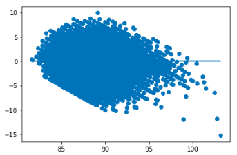

# wine_reviews
By JP Rinfret and Garrett Keyes

## Overview:
Wine is one of the most widely consumed types of alcohol in the world. And many wine drinkers would even consider it the most prestigous. A major determinant in whether a wine a of high quality or not is what its associated rating is. Wine is rated on an 80-100 scale based on taster reviews by organizations including Wine Spectator, wine.com, vivino, and Wine Enthusiast. But the rating given to each wine may not always be what it should. Using multi-linear regression we seek to predict the rating a wine should receive based on grape , province, vintage year, price, and an aggregation of critic reviews. 

[Executive Overview](https://docs.google.com/presentation/d/16AflvwtjYgCDZ4M5CGoQz2o1lbqeyB5Cm6XoSGZy34k/edit?usp=sharing)

## Data:
The data used for this project comes from a Kaggle wine reviews data set composed of 130,000 reviews gathered in 2017.

Please find the raw dataset here: https://www.kaggle.com/zynicide/wine-reviews

## Exploratory Data Analysis:

## Transformtions and Feature Engineering:
We observed that our data was not noramlly distributed or effeciently homoscedastic after completing the cleaning process and creating dummy variables for our categorical data. And this resulted in the r2 value being higher than it should have been.

QQ Plot             |  Homoscedasticity    | OLS Regression Results
:-------------------------:|:-------------------------:|:-------------------------:
  |     | 

Specifically our price data was not normally distrubted and needed to be transformed into a normal distribution by taking the log() of the column. 
 
 Before Log Transformation             |  After Log Transformation
:-------------------------:|:-------------------------:
  |  

Transforming price resulted in our data bcoming more normally distributed, having greater homoscedacity, and have a lower r2 value. 

QQ Plot             |  Homoscedasticity    | OLS Regression Results
:-------------------------:|:-------------------------:|:-------------------------:
  |     | 

## Testing Models:

## Example:

## Libraries Used:
**Statsmodels** for OLS formula and QQ plot  
**Pandas** for dataframes and generating dummy variables  
**Numpy** for logarithmic transformation  
**scipy.stats** for statistical operations  
**sklearn.linear_model** for generating linear, Ridge, and Lasso Models  
**sklearn.model_selection** for creating train test split  
**sklearn.preprocessing** for scaling using StandardScaler  
**nbimporter** for importing from seperate jupyter notebooks  
**seaborn** for heatmap visualization  
**Matplotlib** for data visualization  
